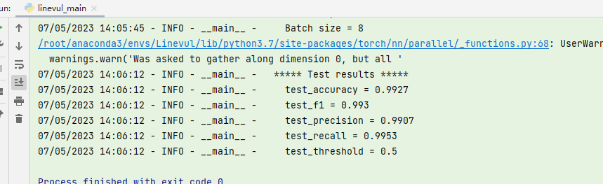
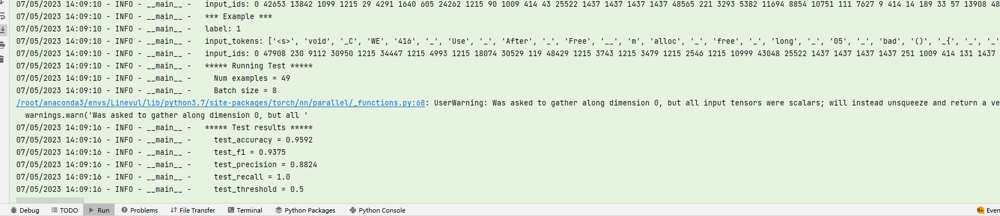

输入的特征：函数源码

检测级别：对函数块检测是否包含漏洞

（实际代码逻辑：函数源码tokenizer分为token并序列化->`RobertaForSequenceClassification` 类继承自 `RobertaPreTrainedModel` 类，它在 codebert-base模型的基础上添加了一个分类层，用于将模型的输出映射为类别标签)

训练+测试命令：

```
python ./linevul/linevul_main.py
--data_file=/home/ExperimentalEvaluation/data/github_0.7
--output_dir=./saved_models
--model_type=roberta
--tokenizer_name=microsoft/codebert-base
--model_name_or_path=microsoft/codebert-base
--do_train
--do_test
--epochs
10
--block_size
512
--train_batch_size
8
--eval_batch_size
8
--learning_rate
2e-5
--max_grad_norm
1.0
--evaluate_during_training
--seed
123456
```
github去除0.7效果

sard 416
