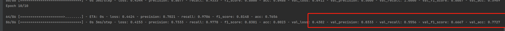

# TDSC

## Environment
```shell
Reproduction:
Software Environment
Tensorflow >= 1.5
Keras >= 2.1.6
Scikit-learn
Gensim
Python >= 2.7
CuDNN >=7.1.4
```

### RUN

```shell
python vuldeepecker.py
```



结果记录

